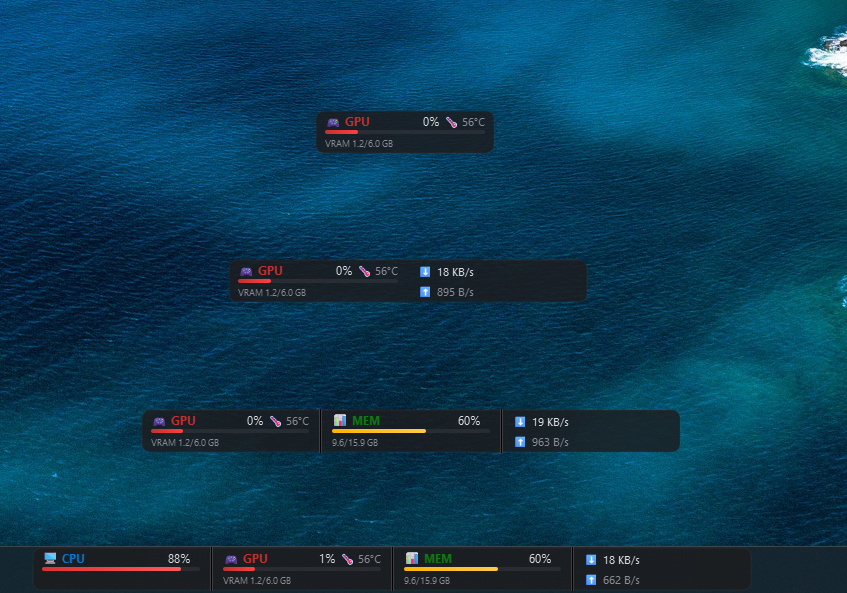

# SysMon — Windows 桌面系统监控条

实时显示 CPU / GPU / 内存 / 网速，悬浮在任务栏上方，半透明无边框，支持拖拽和右键菜单。

## 功能

- 🖥 **CPU** — 使用率 + 温度
- 🎮 **GPU** — 使用率 + 显存 + 温度（NVIDIA）
- 📊 **内存** — 使用率 + 已用/总量
- 🌐 **网速** — 下载/上传速率
- 🎨 半透明毛玻璃效果，无边框，始终置顶
- 🖱 拖拽移动，双击复位
- 📋 右键菜单：选择性显示 / 退出
- 🔧 可选择只显示部分指标，显示条自动缩宽

## 快速开始（推荐）

从 [Releases](../../releases) 下载 `SysMon.exe`，双击运行。无需安装 Python 或任何依赖。

## 开发者安装

```bash
git clone https://github.com/你的用户名/sysmon.git
cd sysmon
python -m venv .venv
.venv\Scripts\pip install -r requirements.txt
```

## 使用

```bash
# 方式一：exe（推荐）
双击 SysMon.exe

# 方式二：Python
start.bat

# 方式三：命令行
.venv\Scripts\pythonw.exe sysmon.pyw
```

监控条出现在屏幕底部任务栏上方。右键可选择显示/隐藏 CPU、GPU、内存、网速。

## 构建 .exe

```bash
pip install pyinstaller
pyinstaller --onefile --windowed --name SysMon sysmon.pyw
# 输出在 dist/SysMon.exe
```

## 开机自启

1. `Win + R` 输入 `shell:startup` 打开启动文件夹
2. 将 `SysMon.exe` 或 `start.vbs` 快捷方式放入该文件夹

## 依赖

| 包 | 用途 |
|---|---|
| [PySide6](https://pypi.org/project/PySide6/) | Qt GUI 框架 |
| [psutil](https://pypi.org/project/psutil/) | CPU / 内存 / 网速采集 |
| [nvidia-ml-py](https://pypi.org/project/nvidia-ml-py/) | NVIDIA GPU 监控 |
| [pywin32](https://pypi.org/project/pywin32/) | Windows API 调用 |
| [wmi](https://pypi.org/project/WMI/) | CPU 温度读取 |

## 截图



## 许可证

MIT License — 详见 [LICENSE](LICENSE)
