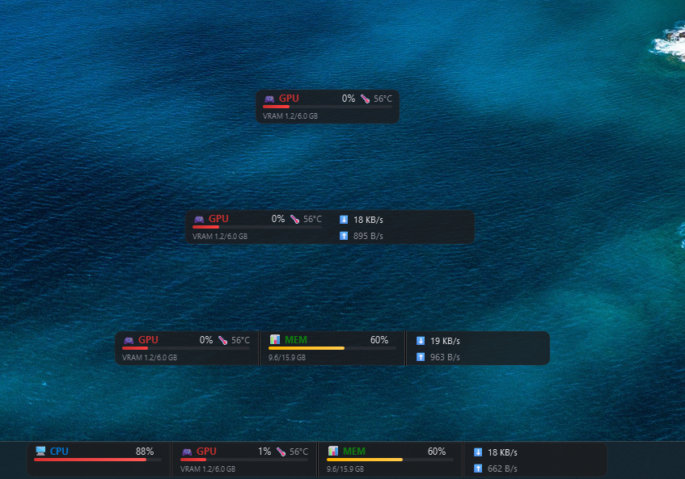

# HoverBar

半透明 Windows 任务栏监控条 — 实时显示 CPU/GPU/内存/网速
A translucent system monitor bar for Windows taskbar — real-time CPU, GPU, memory & network

---

## Features 功能

| | |
|---|---|
| 🖥 **CPU** | 使用率 + 温度 / Usage + Temperature |
| 🎮 **GPU** | 使用率 + 显存 + 温度（NVIDIA）/ Usage + VRAM + Temperature |
| 📊 **Memory 内存** | 使用率 + 已用/总量 / Usage + Used/Total |
| 🌐 **Network 网速** | 下载/上传速率 / Download/Upload speed |
| 🎨 | 半透明毛玻璃，无边框，始终置顶 / Translucent, borderless, always on top |
| 🖱 | 拖拽移动，双击复位 / Drag to move, double-click to dock |
| 📋 | 右键菜单选择显示/隐藏 / Right-click to toggle sections |
| 🔧 | 可自定义，自动适应宽度 / Customizable, auto-adjusts width |

## Quick Start 快速开始

**Download 下载** `HoverBar.exe` from [Releases](../../releases) and double-click. No Python required.
从 [Releases](../../releases) 下载 `HoverBar.exe`，双击运行，无需安装 Python。

## Development 开发

```bash
git clone https://github.com/anzye2016/hoverbar.git
cd hoverbar
python -m venv .venv
.venv\Scripts\pip install -r requirements.txt
```

## Usage 使用

```bash
# exe (recommended / 推荐)
Double-click / 双击 HoverBar.exe

# Python source
start.bat

# Or directly / 或直接运行
.venv\Scripts\pythonw.exe hoverbar.pyw
```

The bar appears at the bottom of the screen above the taskbar. Right-click to toggle sections.
监控条显示在屏幕底部任务栏上方，右键菜单可选择显示/隐藏。

## Build 构建

```bash
Double-click build.bat        # One-click build / 一键编译（推荐）
# Or manually / 或手动编译：
.venv\Scripts\pip install pyinstaller
.venv\Scripts\python.exe -m PyInstaller HoverBar.spec
```

Output / 输出: single-file `HoverBar.exe` in the project root / 位于项目根目录。

## Startup 开机自启

1. `Win + R` → `shell:startup`
2. Place shortcut to `HoverBar.exe` or `start.vbs` in the folder
   将 `HoverBar.exe` 或 `start.vbs` 快捷方式放入该文件夹

## Dependencies 依赖

| Package | 用途 | Purpose |
|---|---|---|
| [PySide6](https://pypi.org/project/PySide6/) | Qt GUI 框架 | Qt GUI framework |
| [psutil](https://pypi.org/project/psutil/) | CPU / 内存 / 网速 | CPU / Memory / Network |
| [nvidia-ml-py](https://pypi.org/project/nvidia-ml-py/) | NVIDIA GPU 监控 | NVIDIA GPU monitoring |
| [pywin32](https://pypi.org/project/pywin32/) | Windows API | Windows API |
| [wmi](https://pypi.org/project/WMI/) | CPU 温度 | CPU temperature |

## Screenshot 截图



## License 许可证

MIT License — see [LICENSE](LICENSE) / 详见 [LICENSE](LICENSE)
