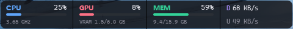

# HoverBar

半透明 Windows 任务栏监控条 — 实时显示 CPU/GPU/内存/网速
A translucent system monitor bar for Windows taskbar — real-time CPU, GPU, memory & network

---

## Features 功能

| | |
|---|---|
| 🖥 **CPU** | 使用率 + 频率 / Usage + Frequency |
| 🎮 **GPU** | 使用率 + 显存（NVIDIA）/ Usage + VRAM (NVIDIA) |
| 📊 **Memory 内存** | 使用率 + 已用/总量 / Usage + Used/Total |
| 🌐 **Network 网速** | 下载/上传速率 / Download/Upload speed |
| 🎨 **Appearance 外观** | 半透明深色，无边框，始终置顶 / Translucent dark, borderless, always on top |
| 🖱 **Interaction 交互** | 拖拽移动，双击复位 / Drag to move, double-click to dock |
| 📋 **Menu 菜单** | 右键选择显示/隐藏区块 / Right-click to toggle sections |
| 🔧 **Layout 布局** | 宽度自适应，高度跟随任务栏 / Auto-fit width, height follows taskbar |

## Quick Start 快速开始

`HoverBar.exe` is **not** tracked in this repo — build it yourself (see [Build](#build-构建)) or run from source (see [Usage](#usage-使用)).
本仓库**不包含** `HoverBar.exe`（已 gitignore），需自行构建（见 [Build 构建](#build-构建)），或直接以源码运行（见 [Usage 使用](#usage-使用)）。

## Development 开发

Requires Python 3.10+ / 需要 Python 3.10+。

```bash
git clone https://github.com/anzye2016/hoverbar.git
cd hoverbar
python -m venv .venv
.venv\Scripts\pip install -r requirements.txt
```

## Usage 使用

```bash
# Source / 源码运行（首次自动装依赖）
start.bat

# Or directly / 或直接运行
.venv\Scripts\pythonw.exe hoverbar.pyw

# Built exe / 已构建的 exe（双击）
HoverBar.exe
```

The bar docks at the bottom-left, above the taskbar, with height matching the taskbar. Right-click to toggle sections.
监控条停靠在屏幕左下角、任务栏上方，高度自动匹配任务栏；右键菜单可选择显示/隐藏。

## Build 构建

```bash
Double-click build.bat        # One-click build / 一键编译（推荐）
# Or manually / 或手动编译：
.venv\Scripts\pip install pyinstaller
.venv\Scripts\python.exe -m PyInstaller HoverBar.spec
```

Output / 输出: single-file `HoverBar.exe` in the project root / 位于项目根目录。

## Startup 开机自启

1. `Win + R` → `shell:startup`
2. Place shortcut to `HoverBar.exe` or `start.vbs` in the folder
   将 `HoverBar.exe` 或 `start.vbs` 快捷方式放入该文件夹

## Dependencies 依赖

| Package | 用途 | Purpose |
|---|---|---|
| [PySide6](https://pypi.org/project/PySide6/) | Qt GUI 框架 | Qt GUI framework |
| [psutil](https://pypi.org/project/psutil/) | CPU / 内存 / 网速 | CPU / Memory / Network |
| [nvidia-ml-py](https://pypi.org/project/nvidia-ml-py/) | NVIDIA GPU 监控 | NVIDIA GPU monitoring |
| [pywin32](https://pypi.org/project/pywin32/) | Windows API | Windows API |

## Screenshot 截图



## License 许可证

MIT License — see [LICENSE](LICENSE) / 详见 [LICENSE](LICENSE)
